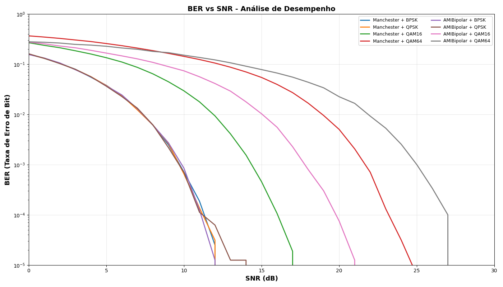

# Simulador de Transmissão Digital - Redes de Computadores

**Universidade do Vale do Rio dos Sinos (UNISINOS)**

* **Disciplina:** Redes de Computadores
* **Professor:** Cristiano Bonato Both
* **Semestre:** 2025/02
* **Alunos:** Gustavo Parcianello Cardona, Murilo Schuck

---

## Índice

1. [Objetivo](#objetivo)
2. [Contextualização](#contextualização)
3. [Arquitetura do Sistema](#arquitetura-do-sistema)
4. [Tecnologias Implementadas](#tecnologias-implementadas)
5. [Como Executar](#como-executar)
6. [Resultados e Análises](#resultados-e-análises)
7. [Conclusão](#conclusão)

---

## Objetivo

Desenvolver e aplicar os conceitos de **codificação de canal** e **modulação digital**, analisando seu impacto na **Taxa de Erro de Bits (BER)** e na eficiência espectral de sistemas de comunicação.

O simulador implementa um sistema completo de transmissão digital, desde a geração da mensagem até a recuperação da informação no receptor, em condições de ruído controlado.

### Objetivos específicos:
- Implementar codificação de canal (Manchester e AMI Bipolar)
- Implementar modulação digital (BPSK, QPSK, 16-QAM, 64-QAM)
- Simular canal ruidoso (AWGN) com SNR configurável
- Calcular e comparar BER entre diferentes esquemas

---

## Arquitetura do Sistema

O simulador implementa o fluxo completo de transmissão digital:

```
┌─────────────────────────────────────────────────────────────────┐
│                         TRANSMISSOR                             │
└─────────────────────────────────────────────────────────────────┘
       │
       ▼
   [ ASCII ]  ─────→  "Hello World"
       │
       ▼
   [ Bits ]   ─────→  01001000 01100101 01101100...
       │
       ▼
   [ Encoder ] ─────→  Manchester ou AMI Bipolar
       │
       ▼
   [ Modulator ] ───→  BPSK/QPSK/16-QAM/64-QAM
       │
       ▼
┌─────────────────────────────────────────────────────────────────┐
│                      CANAL COM RUÍDO (AWGN)                     │
│                        SNR configurável                         │
└─────────────────────────────────────────────────────────────────┘
       │
       ▼
   [ Símbolos + Ruído ]
       │
       ▼
┌─────────────────────────────────────────────────────────────────┐
│                           RECEPTOR                              │
└─────────────────────────────────────────────────────────────────┘
       │
       ▼
   [ Demodulator ] ──→  Decisão por distância mínima
       │
       ▼
   [ Decoder ] ───────→  Reconstrução dos níveis de linha
       │
       ▼
   [ Bits ] ──────────→  01001000 01100101 01101100...
       │
       ▼
   [ ASCII ] ─────────→  "Hello World"
       │
       ▼
   [ BER Calculation ] → Taxa de erro de bits
```

---

## Tecnologias Implementadas

### 1. Codificação de Canal

#### **Manchester Encoder**
- Cada bit é representado por uma transição
  - Bit 0: LOW → HIGH (transição ascendente)
  - Bit 1: HIGH → LOW (transição descendente)


#### **AMI Bipolar Encoder**
- Usa três níveis de tensão
  - Bit 0: Nível 0
  - Bit 1: Alterna entre +1 e -1


### 2. Modulação Digital

| Modulação | Bits/Símbolo | Pontos na Constelação |
|-----------|--------------|----------------------|
| **BPSK**  | 1            | 2                    |
| **QPSK**  | 2            | 4                    |
| **16-QAM**| 4            | 16                   |
| **64-QAM**| 6            | 64                   |


### 3. Canal Ruidoso (AWGN)

**AWGN** = Additive White Gaussian Noise (Ruído Gaussiano Branco Aditivo)

---

## Como Executar

### Pré-requisitos

- Python 3.8 ou superior
- Bibliotecas: `numpy`, `matplotlib`

### Instalação das Dependências

```bash
pip install numpy matplotlib
```

### Estrutura de Arquivos

```
digital-transmission-simulator/
│
├── src/
│   ├── data.py              # ASCII ↔ Bits
│   ├── encoder.py           # Manchester e AMI Bipolar
│   ├── modulator.py         # BPSK, QPSK, 16-QAM, 64-QAM
│   ├── noise.py             # Canal AWGN
│   ├── utils.py             # Funções auxiliares e BER
│   ├── main.py              # demo
│   └── benchmark_ber.py     # Benchmark BER vs SNR
│
├── README.md
└── .gitignore
```

### Execução

#### 1. Simulação Completa (Demo)

Executa o fluxo completo com visualizações:

```bash
python src/main.py
```

#### 2. Benchmark BER vs SNR

Gera o gráfico comparativo principal:

```bash
python src/benchmark_ber.py
```

#### Demo - Encoder=Manchester, Modulator=QPSK, Noise=AWGN
##### Um caractere (apenas um byte), para melhor visualização
https://github.com/user-attachments/assets/21171f99-2c10-433c-9226-b34db68c408c
##### Uma frase (diversos bytes), para ver como ficaria a visualização
https://github.com/user-attachments/assets/76392037-8c7b-4c7f-b78e-afd91f21c2c0

#### Demo - Encoder=Manchester, Modulator=QAM64, Noise=AWGN (apenas um byte, para melhor visualização)
##### Um caractere (apenas um byte), para melhor visualização
https://github.com/user-attachments/assets/8fdbfd61-b06b-44f5-9181-279ee261e09b
##### Uma frase (diversos bytes), para ver como ficaria a visualização


#### Demo - Encoder=AMI Bipolar, Modulator=QPSK, Noise=AWGN (apenas um byte, para melhor visualização)
tbd

#### Demo - Encoder=AMI Bipolar, Modulator=QAM64, Noise=AWGN (apenas um byte, para melhor visualização)
tbd

---

## Resultados e Análises

### Gráfico Principal: BER vs SNR



**Configuração do teste:**
- Mensagem: 10.000 caracteres (80.000 bits)
- SNR: 0 a 30 dB (passos de 1 dB)
- Total: 8 combinações testadas
--- 

## Conclusão

1. Não existe modulação universalmente melhor
2. Manchester: Melhor sincronização, menor eficiência; AMI: Melhor eficiência, detecção de erros

### Limitações do Simulador

1. Apenas AWGN (ruído branco gaussiano)
2. Sem códigos de correção de erro (FEC)
3. Sem overhead de protocolos
4. SNR não varia

### Possibilidades

- Implementar códigos de correção de erro (Hamming, Reed-Solomon)
- Simular modulação adaptativa
- Adicionar métricas de throughput efetivo

---

### Referência de Comportamento


> Salih, Sami & Al-Refai, Ali & Suliman, Mamoun & Mohammed, Abbas. (2013). Implementation of adaptive modulation for broadband wireless access networks using cognitive radio approaches. 345-349. 10.1109/ICCEEE.2013.6633960. 
